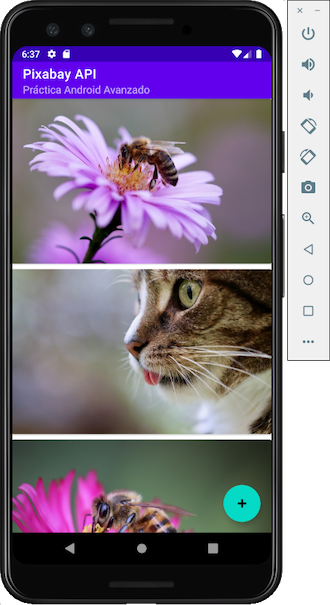
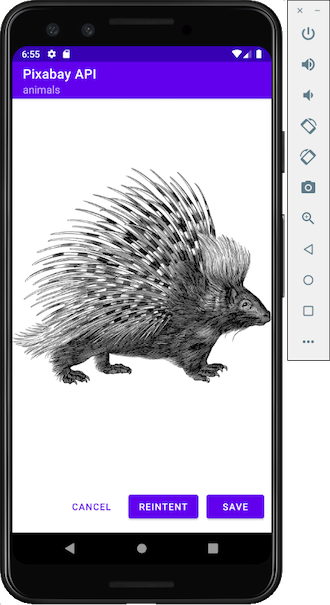

## Objetivo
Aplicar conceptos avanzados en el desarrollo de aplicaciones **Android**, tales como LiveData y el uso de librerías como Retrofit.

Para ello se ha implementado una pequeña aplicación capaz de consumir un servicio API y guardar esa información, retornada por el servicio, en local.

- Kotlin
- Retrofit library, Gson, Glide
- Arquitectura MVVM, ViewModel, LiveData
- Room Database
- Material design
- Android Studio

## Servicio elegido

- [Pixabay API](https://pixabay.com/api/docs/) (requiere registro para obtener una key).

##### Capturas de pantallas

